# Trie Data Structure Unit Testing - Software Verification and Validation (VVS)

**Author:** Gabriel Henriques (fc58182)

**Grade:** 9.16/10

## Introduction

This report details the comprehensive unit testing strategy implemented to verify a Trie data structure implementation using ternary trees for efficient key-value pair storage and retrieval. Multiple complementary testing approaches were employed to ensure thorough verification:

- Code Coverage testing focusing on line and branch coverage for all public methods
- Path-based testing including Edge-Pair and Prime Path Coverage for specific methods
- Data flow testing through All-Du-Paths and All-Coupling-Use-Paths Coverage
- Logic-based testing for selected methods
- Input State Partitioning using Base Choice Coverage
- Property-based testing using JUnit QuickCheck for behavioral verification
- Mutation testing using PIT to evaluate and improve test effectiveness

Together, these testing methods provide thorough verification of both structural and behavioral aspects of the Trie implementation while allowing targeted testing of specific methods and properties.

## [Line Coverage](src/test/java/sut/coverage/line)

Line Coverage was achieved for all public methods by performing the minimum necessary tests that passed through each line of code at least once. All methods obtained green coverage except for `longestPrefixOf` and `put`, as not enough tests were done to pass through all branches.

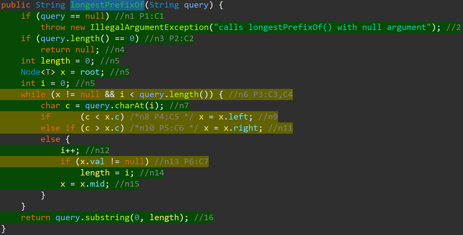

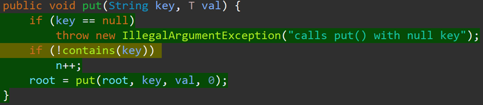

## [Branch Coverage](src/test/java/sut/coverage/branch)

For Branch Coverage, all tests previously written for Line Coverage were performed, with the addition of 3 more tests for `longestPrefixOf` and 1 more test for `put`, in order to satisfy the coverage that previously appeared in yellow due to not testing all method branches. This demonstrated that Branch Coverage tests the system more exhaustively, without requiring further analysis compared to Line Coverage.

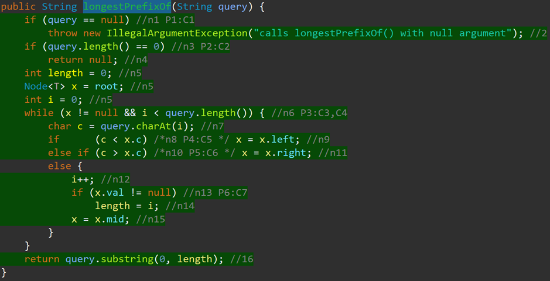

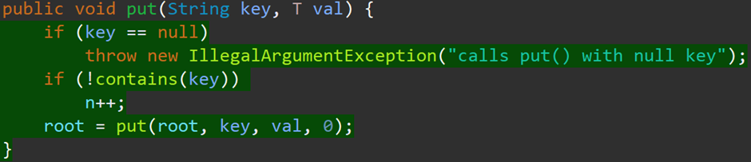

## [Edge-Pair Coverage](src/test/java/sut/coverage/edgepair)

To satisfy Edge-Pair Coverage, it was necessary to create a graph of the [longestPrefixOf](src/test/java/sut/coverage/edgepair/TestTSTLongestPrefixOf.java) method as shown in the following image:

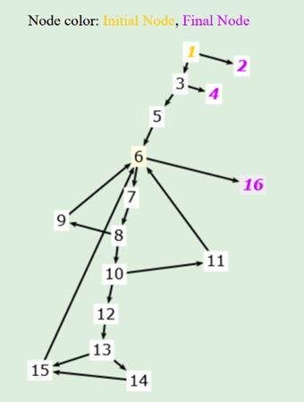

After creating the graph, its edges, initial node and final nodes were entered into https://cs.gmu.edu:8443/offutt/coverage/GraphCoverage, and Algorithm 2 generated the paths to be traversed by the tests in order to satisfy Edge-Pair Coverage:

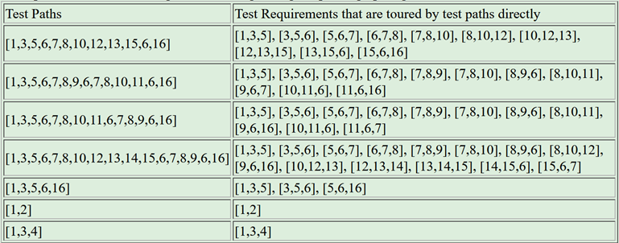

## [Prime Path Coverage](src/test/java/sut/coverage/primepath)

For Prime Path Coverage of the [longestPrefixOf](src/test/java/sut/coverage/primepath/TestTSTLongestPrefixOf.java) method, the same procedure was followed, but Algorithm 1 was chosen which generated more paths, though shorter ones, thus reducing the complexity in writing the tests:

## [All-Du-Paths Coverage](src/test/java/sut/coverage/alldupaths)

For All-Du-Paths Coverage of [longestPrefixOf](src/test/java/sut/coverage/alldupaths/TestTSTLongestPrefixOf.java), the same previously created graph was used again, but this time it was also analyzed in which nodes and edges each variable is defined and used, obtaining the following table:

| Nodes & Edges    | def(I)        | use(I)         |
|-----------------|---------------|----------------|
| 1               | {query}       |                |
| (1,2), (1,3)    |               | {query}        |
| 3               |               |                |
| (3,4), (3,5)    |               | {query}        |
| 5               | {len, x, i}   |                |
| (5,6)           |               |                |
| 6               |               |                |
| (6,7), (6,16)   |               | {x, i, query}  |
| 7               | {c}           | {query, i}     |
| (7,8)           |               |                |
| 8               |               |                |
| (8,9), (8,10)   |               | {c, x}         |
| 9               | {x}           | {x}            |
| (9,6)           |               |                |
| 10              |               |                |
| (10,11), (10,12)|               | {c, x}         |
| 11              | {x}           | {x}            |
| (11,6)          |               |                |
| 12              | {i}           | {i}            |
| (12,13)         |               |                |
| 13              |               |                |
| (13,14), (13,15)|               | {x}            |
| 14              | {len}         | {i}            |
| (14,15)         |               |                |
| 15              | {x}           | {x}            |
| (15,6)          |               |                |
| 16              |               | {query, len}   |

Subsequently, the edges, initial node, final nodes, defs and uses of the variables were entered into https://cs.gmu.edu:8443/offutt/coverage/DFGraphCoverage and the test paths were generated for each variable:

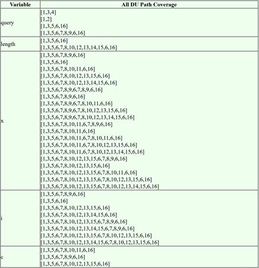

Some variables had identical test paths, meaning that a single path could satisfy multiple requirements, so it wasn't necessary to write as many unit tests as paths generated.

## [All-Coupling-Use-Paths Coverage](src/test/java/sut/coverage/allcouplingusepaths)

To satisfy All-Coupling-Use-Paths, it was necessary to analyze the [put](src/test/java/sut/coverage/allcouplingusepaths/TestTSTPut.java) method and create a graph representation of it. The edges from nodes 5, 7 and 9 to node 1 represent the recursive calls.

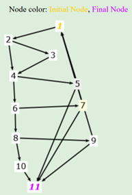

With the graph completed, it was necessary to analyze in which nodes the last definitions of variables occur before recursive calls, and also in which nodes of the called function the passed variables are first used, obtaining the following table:

| Last-def        | First-use      |
|-----------------|----------------|
| key: {1}        | key: {i}       |
| val: {1}        | val: {v, vii, ix, x} |
| x: {1,3}        | x: {ii}        |
| d: {1,9}        | d: {i}         |
| x' : {v, vii, ix, x} | x' : {11} |

With this information, it was then possible to verify which paths the tests need to traverse in order to satisfy All-Coupling-Use-Paths coverage:

| Variable | Path 1 | Path 2 | Path 3 | Path 4 |
|----------|---------|---------|---------|---------|
| key | key {1} -> key {i} | | | |
| val | val {1} -> val {v} | val {1} -> val {vii} | val {1} -> val {ix} | val {1} -> val {x} |
| x | x {1} -> x {ii} | x {3} -> x {ii} | | |
| d | d{1} -> d{i} | d{9} -> d{i} | | |
| x' | x'{v} -> x'{11} | x'{vii} -> x'{11} | x'{ix} -> x'{11} | x'{x} -> x'{11} |

## [Logic-based Coverage](src/test/java/sut/coverage/logicbased)

Since the [longestPrefixOf](src/test/java/sut/coverage/logicbased/TestTSTLongestPrefixOf.java) method has simple predicates, where only one of them has more than one clause, it was decided not to overcomplicate and choose one of the basic criteria. In this case, Combinatorial Coverage was chosen as it is the most comprehensive without overly complicating test implementation.

## [Base Choice Coverage](src/test/java/sut/coverage/isp_basechoice)

In Base Choice Coverage for the method [put](src/test/java/sut/coverage/isp_basechoice/TestTSTPut.java), each characteristic was subdivided binarily, with the exception of the last one which was divided ternarily. A Base Choice was selected according to what was considered the most common case:
1. The new key not yet being in the Trie
2. A prefix of the new key not yet existing in the Trie  
3. The Trie not being empty
4. The new key is a typical key (in lexicographic terms)

A test was created for the Base Choice and also tests for each characteristic change from the Base Choice.

## PIT Mutation Coverage

When running the program mutations through PIT, it was possible to kill the generated mutants in (almost) all Coverage Criteria of `longestPrefixOf`:

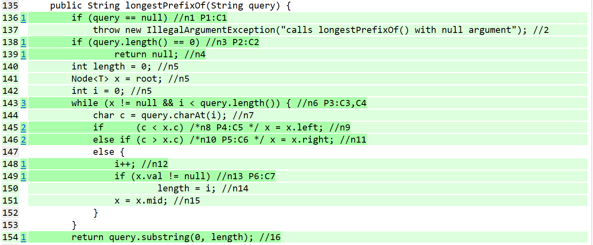

With the exception of Line Coverage which was not able to kill the following mutant:

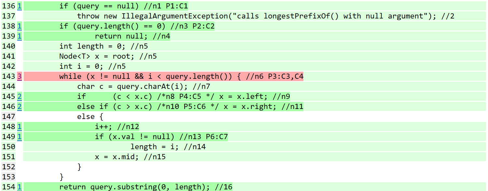

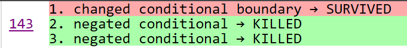

This mutant could have been detected and killed by adding the following test:

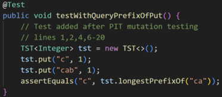

## [JUnit QuickCheck](src/test/java/sut/quickcheck)

To perform QuickCheck tests, it was necessary to add three methods to the system: [`equals()`](src/main/java/sut/TST.java#L264-L288), [`delete()`](src/main/java/sut/TST.java#L233-L247) and [`clone()`](src/main/java/sut/TST.java#L249-L261). It was also necessary to create three generator classes: [`TrieGenerator`](src/test/java/generators/TrieGenerator.java), [`KeyGenerator`](src/test/java/generators/KeyGenerator.java) and [`KeyListGenerator`](src/test/java/generators/KeyListGenerator.java).

To test the property ["The order of insertion of different keys does not change the final tree value"](src/test/java/sut/quickcheck/TestTSTQuickCheck.java#L27-L51), it was necessary to receive a Trie, a list of Keys, and a randomly generated value. The received Trie was initially cloned and then the Keys were added to the original Trie. Then the order of the Keys was shuffled and they were added to the cloned Trie. Finally, the original Trie was compared with the cloned Trie.

To test the property ["If you remove all keys from a tree, the tree must be empty"](src/test/java/sut/quickcheck/TestTSTQuickCheck.java#L55-L76), it was necessary to receive a randomly generated Trie. All Keys present in the Trie were removed, and then the Trie was compared with an empty initialized Trie, and it was also verified that its size is 0.

To test the property ["Given a tree, inserting and then removing the same key value will not change its initial value"](src/test/java/sut/quickcheck/TestTSTQuickCheck.java#L78-L103), it was necessary to receive a Trie, a Key, and a randomly generated value. The received Trie was initially cloned, and then the Key was added with the given value, and removed. Finally, the initial (cloned) Trie was compared with the final Trie. This property is not true for Tries that already contain the value to be added/removed, because after addition/removal, the initial Trie would be different from the final one.

To test the property ["Selecting a stricter prefix keysWithPrefix returns a strict subset result"](src/test/java/sut/quickcheck/TestTSTQuickCheck.java#L106-L161), it was necessary to receive a Trie, a list of Keys, and a randomly generated value. All Keys from the Trie were initially fetched, and one of them was randomly selected to be the base Key. Then, new random Keys were added to the Trie, all with the prefix of the base Key, and keysWithPrefix(base_key) was stored. Finally, it was verified that with all possible prefixes of the base Key (removing character by character) you always get a subset of keysWithPrefix(base_key).
